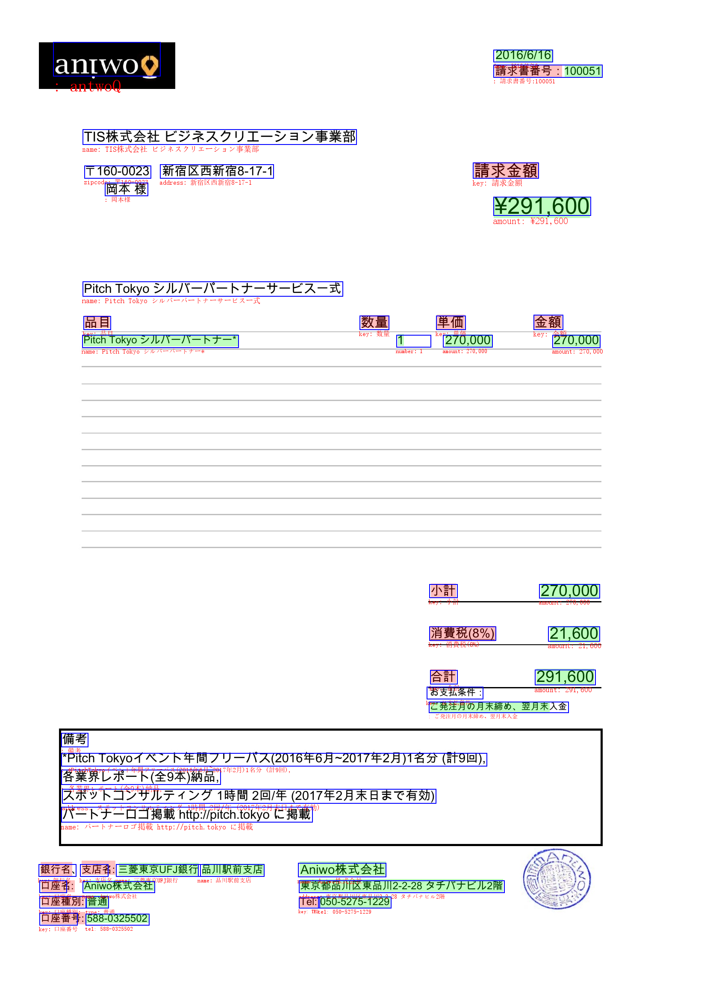

# Applications of NLP approaches in Information Extraction
--------------------
|Summary ||
|:-|:-|
|Topic| Applications of NLP approaches in Information Extraction|
|Members| Cain|
|Research period| 4/5/2020 - 7/2020|
--------------------
#### Deliverables:
- [Benchmark](#benchmark)
- [Code]()

## Scopes
|-|Descriptions|
|:--|:--|
|Dataset| Invoice|
|Encoder| BoW, Word2Vec, FastText, BERT|
|Classifier| SVM, CNN|

## <a name="benchmark"> Benchmark </a>
|Encoder + Classifier\ Dataset| Invoice |
|:--------|:--:|
|[Baseline (BoW + SVM)](#bowsvm)| 0.6 |
| [Word2Vec + SVM](#w2vsvm)| 0.85 |
| (FastText + SVM)| - |
| [BERT + SVM](#bertsvm)| 0.87 |

# EXPERIMENTS
## PRELIMILARY EXPERIMENTS 
### <a name="dataset"> Dataset details </a>
|Dataset| ||
|:-|:-|:-|
|Invoice| | |
|Trainset | DATAPILE v10. (835 files)|| 
|Testset  | DATAPILE v13. (338 files)||
|FULL| Fields| Notes|
|| - 'account_name'   - 'account_number'   - 'account_type'   - 'amount_excluding_tax'   - 'amount_including_tax'   - 'bank_name'   - 'branch_name'  - 'company_address'   - 'company_department_name'   - 'company_fax'   - 'company_name'   - 'company_tel'   - 'company_zipcode'   - 'delivery_date'   - 'document_number'   - 'invoice_number'   - 'issued_date'   - 'item_line_number'   - 'item_name'   - 'item_quantity'   - 'item_quantity_item_unit'   - 'item_total_excluding_tax'   - 'item_total_including_tax'   - 'item_unit'   - 'item_unit_amount'   - 'payment_date'   - 'tax'||
|PREMILARY CONFIG|||
|Classes|- amount   - date   - name   - quantity   - type ||

#### <a name="bowsvm"> BoW + SVM </a>
Here are the accuracy report and the confusion matrix for this configuration.
|ACCURACY REPORT (Invoice)|precision|recall|f1-score|support|
|:--|:-:|:-:|:-:|:-:|
|OTHER|0.49|0.96|0.65|2775|
|amount|0.69|0.26|0.38|961|
|date|0.96|0.81|0.88|734|
|name|0.99|0.41|0.58|2154|
|quantity|0.83|0.03|0.06|299|
|type|0.00|0.00|0.00|397|
|accuracy|||0.60|7320|
|macro avg|0.66|0.41|0.43|7320|
|weighted avg|0.70|0.60|0.56|7320|

|CONFUSION MATRIX|OTHER|amount|date|name|quantity|type|
|:-|:-:|:-:|:-:|:-:|:-:|:-:|
|OTHER|2665|100|1|9|0|0|
|amount|707|254|0|0|0|0|
|date|139|0|593|2|0|0|
|name|1248|2|23|879|2|0|
|quantity|277|12|0|0|10|0|
|type|397|0|0|0|0|0|

-------
#### Discussion:
- The classification rate is not good at all with this configuration (0.6)
- Only date is well recognized based on the mechasism of BoW (the existence of date characters as special symbols)
- It totally fails to catch the quantity and type classes, which could only recognize as the number or characters

####  <a name="w2vsvm"> Word2Vec + SVM </a>

|ACCURACY REPORT (Invoice)|precision|recall|f1-score|support|
|:--|:-:|:-:|:-:|:-:|
|       |0.79   |0.86   |0.83   |2775   |
|amount |0.65   |0.55   |0.60   |961    |
|date   |0.99   |0.89   |0.94   |734    |
|name   |0.94   |0.98   |0.96   |2154   |
|quantity|0.84  |0.66   |0.74   |299    |
|type   |1.00   |0.90   |0.95   |397    |
|accuracy|      |       |0.85   |7320   |
|macro avg|0.87 |0.81   |0.83   |7320   |
|weighted avg|0.85|0.85 |0.85   |7320   |

|CONFUSION MATRIX|OTHER|amount|date|name|quantity|type|
|:-|:-:|:-:|:-:|:-:|:-:|:-:|
|OTHER  |2400| 277 |   1 |   67|   30 |  0 |
|amount |426 | 527 |   0 |    5|   3  |  0 |
|date   |69  |  0  | 652 |   10|   3  |  0 |
|name   |40  |  0  |   5 | 2109|   0  |  0 |
|quantity|88 |  6  |  1  |    8|  196 |  0 |
|type   |0   |  0  |    0|   38|    0 | 359|

#### FastText + SVM
|ACCURACY REPORT (Invoice)|precision|recall|f1-score|support|
|:--|:-:|:-:|:-:|:-:|
|OTHER|     0.79|      0.84|      0.82|      2775|
|amount|    0.65|      0.55|      0.59|       961|
|date|      0.99|      0.87|      0.93|       734|
|name|      0.91|      0.98|      0.95|      2154|
|quantity|  0.86|      0.68|      0.76|       299|
|type|      1.00|      0.93|      0.96|       397|
|accuracy|||                      0.85|      7320|
|macro avg| 0.87|      0.81|      0.83|      7320|
|weighted avg|0.84|    0.85|      0.84|      7320|

|CONFUSION MATRIX|OTHER|amount|date|name|quantity|type|
|:-|:-:|:-:|:-:|:-:|:-:|:-:|
|OTHER      |2328|  277|    1|  140|   29|    0|
|amount     | 422|  526|    1|    9|    3|    0|
|date       |  70|    0|  641|   21|    2|    0|
|name       |  31|    0|    3| 2120|    0|    0|
|quantity   |  79|    6|    2|    8|  204|    0|
|type       |   0|    0|    0|   27|    0|  370|

#### <a name="bertsvm"> BERT + SVM </a>
|ACCURACY REPORT (Invoice)|precision|recall|f1-score|support|
|:--|:-:|:-:|:-:|:-:|
|OTHER|0.79|0.90|0.84|2775|
|amount|0.71|0.54|0.62|961|
|date|1.00|0.88|0.94|734|
|name|0.98|0.96|0.97|2154|
|quantity|0.84|0.72|0.77|299|
|type|0.92|0.97|0.94|397|
|accuracy|||0.87|7320|
|macro avg|0.87|0.83|0.85|7320|
|weighted avg|0.87|0.87|0.86|7320|

|CONFUSION MATRIX|OTHER|amount|date|name|quantity|type|
|:-|:-:|:-:|:-:|:-:|:-:|:-:|
|OTHER |2498|  207|    0|   25|   32|   13|
|amount|437 |  521|    0|    2|    1|    0|
|date  |74  |    0|  646|   11|    3|    0|
|name  |59  |    1|    0| 2068|    5|   21|
|quantity|80  |    4|    1|    0|  214|    0|
|type|1   |  0  |    0|   11|    0|  385|

------
#### Discussion:
- A great improvement with this configuration (87% acc)
- Most of classes are satisfied (> 80% acc)
- There is still a confusion between the amount with the unclassified. Actually, in this preliminary experiments, we extract only 5 common classes, and there is still some unconsidered classes with the same pattern (for ex. tax in the unclassified).

#### VISUALIZATION

|CONFIGURATION||
|:-|:-:|
|ENCODER| Word2Vec|
|CLASSIFIER| SVM|
|CLASS|-"name"   - "date"   - "type"   - "quantity"   - "amount"   - "tel"   - "zipcode"   - "address"   - "unit"   - "number"|

    
     
    <em>Fig. 1: Visualiztion of NLP approaches in Invoice data sample </em>

