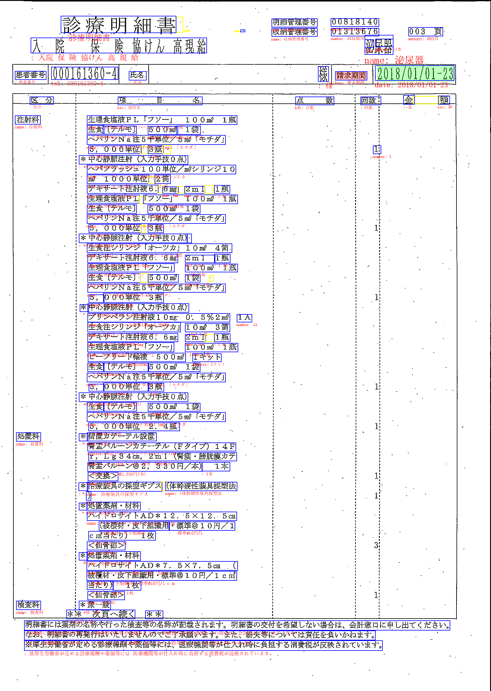
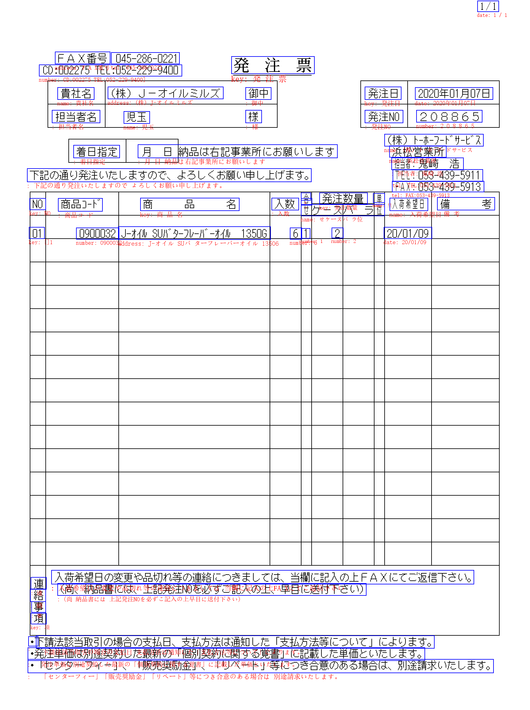

# Applications of NLP approaches in Information Extraction
--------------------
|Summary ||
|:-|:-|
|Topic| Applications of NLP approaches in Information Extraction|
|Members| Cain|
|Research period| 4/5/2020 - 7/2020|
--------------------
#### Deliverables:
- [Benchmark](#benchmark)
- [Code]()

## Scopes
|-|Descriptions|
|:--|:--|
|Dataset| Invoice|
|Encoder| BoW, Word2Vec, FastText, BERT|
|Classifier| SVM, CNN|

## <a name="benchmark"> Benchmark </a>
|Encoder + Classifier\ Infos | Embedding size| Invoice| Invoice - datapile|
|:--------|:--:|:-:|:-:|:-:|:-:|
|[Baseline (BoW + SVM)](#bowsvm)|476| [0.51](#bowsvm_acc) |[0.60](#bowsvmdp_acc)|
| [Word2Vec + SVM](#w2vsvm)|100| [0.93](#w2vsvm_acc) |[0.88](#w2vsvmdp_acc)|
| [FastText + SVM](#ftsvm)|300| [0.94](#ftsvm_acc) |[0.84](#ftsvmdp_acc)|
| [BERT + SVM](#bertsvm)|768| [0.95](#bertsvm_acc) |[0.91](#bertsvmdp_acc)|

# EXPERIMENTS
## PRELIMILARY EXPERIMENTS 
### <a name="dataset"> Dataset details </a>
|Dataset| ||
|:-|:-|:-|
|Invoice| | |
|Trainset | DATAPILE v10. (835 files)|| 
|Testset  | DATAPILE v13. (338 files)||
|FULL| Fields| Notes|
|| - 'account_name'   - 'account_number'   - 'account_type'   - 'amount_excluding_tax'   - 'amount_including_tax'   - 'bank_name'   - 'branch_name'  - 'company_address'   -'company_department_name'   - 'company_fax'   - 'company_name'   - 'company_tel'   - 'company_zipcode'   - 'delivery_date'   - 'document_number'   - 'invoice_number'   - 'issued_date'   - 'item_line_number'   - 'item_name'   - 'item_quantity'   - 'item_quantity_item_unit'   - 'item_total_excluding_tax'   - 'item_total_including_tax'   - 'item_unit'   - 'item_unit_amount'   - 'payment_date'   - 'tax'| 25 acquired fields from Invoice project|
|PREMILARY CONFIG|||
|Classes| - name   - date   - number   - amount   - address   - UNKNOWN | Selected with the help of Kelly from QA team for *mostly accquired* in recently projects|

SVM configuration:
- Default SVM from sklearn with class balanced weight enabled

#### <a name="bowsvm"> BoW + SVM </a>
Here are the accuracy report and the confusion matrix for this configuration.
|ACCURACY REPORT (Invoice)|precision|recall|f1-score|support|
|:--|:-:|:-:|:-:|:-:|
|     UNKNOWN|       0.22|      1.00|      0.36|       971|
|     address|       0.71|      0.72|      0.71|       185|
|      amount|       1.00|      0.43|      0.60|      2166|
|        date|       0.97|      0.83|      0.89|       734|
|        name|       1.00|      0.37|      0.54|      2154|
|      number|       0.93|      0.24|      0.38|      1110|
|    accuracy|||  <a name="bowsvm_acc">0.51</a>|      7320|
|   macro avg|       0.80|      0.60|      0.58|      7320|
|weighted avg|       0.87|      0.51|      0.55|      7320|

|CONFUSION MATRIX|UNKNOWN|address|amount|date|name|number|
|:-|:-:|:-:|:-:|:-:|:-:|:-:|
|UNKNOWN    | 967|    0|    0|    0|    0|    4|
|address    |  51|  134|    0|    0|    0|    0|
|amount     |1221|    0|  939|    0|    0|    6|
|date       | 125|    0|    0|  607|    2|    0|
|name       |1266|   56|    1|   21|  799|   11|
|number     | 839|    0|    1|    0|    2|  268|

-------
#### Discussion:
- The classification rate is not good at all with this configuration (0.6)
- Only date is well recognized based on the mechasism of BoW (the existence of date characters as special symbols)
- It totally fails to catch the quantity and type classes, which could only recognize as the number or characters

####  <a name="w2vsvm"> Word2Vec + SVM </a>

|ACCURACY REPORT (Invoice)|precision|recall|f1-score|support|
|:--|:-:|:-:|:-:|:-:|
|UNKNOWN|       0.94|      0.96|      0.95|       971|
|address|       0.74|      0.97|      0.84|       185|
|amount|        0.99|      0.89|      0.94|      2166|
|date|          0.98|      0.89|      0.93|       734|
|name|          0.98|      0.96|      0.97|      2154|
|number|        0.77|      0.94|      0.85|      1110|
|accuracy||  <a name="w2vsvm_acc">0.93</a>|      7320|
|macro avg|     0.90|      0.94|      0.91|      7320|
|weighted avg|  0.94|      0.93|      0.93|      7320|

|CONFUSION MATRIX|UNKNOWN|address|amount|date|name|number|
|:-|:-:|:-:|:-:|:-:|:-:|:-:|
|UNKNOWN|    937|    0|    4|    1|   26|    3|
|address|      0|  179|    0|    0|    6|    0|
|amount|      14|    0| 1934|    1|   10|  207|
|date|         0|    0|    0|  651|    7|   76|
|name|         4|   55|    0|    7| 2058|   30|
|number|      43|    9|   10|    2|    0| 1046|

#### <a name="ftsvm"> FastText + SVM </a>

|ACCURACY REPORT (Invoice)|precision|recall|f1-score|support|
|:--|:-:|:-:|:-:|:-:|
|     UNKNOWN|       0.97|      0.95|      0.96|       971|
|     address|       0.88|      0.91|      0.90|       185|
|      amount|       0.99|      0.90|      0.94|      2166|
|        date|       0.98|      0.88|      0.93|       734|
|        name|       0.96|      0.98|      0.97|      2154|
|      number|       0.78|      0.96|      0.86|      1110|
|    accuracy|||   <a name="ftsvm_acc">0.94</a>|      7320|
|   macro avg|       0.93|      0.93|      0.93|      7320|
|weighted avg|       0.94|      0.94|      0.94|      7320|

|CONFUSION MATRIX|UNKNOWN|address|amount|date|name|number|
|:-|:-:|:-:|:-:|:-:|:-:|:-:|
|UNKNOWN    | 922|    0|    0|    1|   45|    3|
|address    |   0|  169|    0|    0|   16|    0|
|amount     |   8|    2| 1949|    1|    8|  198|
|date       |   1|    0|    0|  644|   13|   76|
|name       |   1|   21|    0|    3| 2101|   28|
|number     |  18|    0|   11|    6|   11| 1064|

#### <a name="bertsvm"> BERT + SVM </a>

|ACCURACY REPORT (Invoice)|precision|recall|f1-score|support|
|:--|:-:|:-:|:-:|:-:|
|     UNKNOWN|       0.95|      0.98|      0.97|       971|
|     address|       0.91|      0.94|      0.93|       185|
|      amount|       0.97|      0.94|      0.96|      2166|
|        date|       1.00|      0.88|      0.94|       734|
|        name|       0.97|      0.96|      0.96|      2154|
|      number|       0.84|      0.94|      0.89|      1110|
|    accuracy||| <a name="bertsvm_acc">0.95</a>|      7320|
|   macro avg|       0.94|      0.94|      0.94|      7320|
|weighted avg|       0.95|      0.95|      0.95|      7320|

|CONFUSION MATRIX|UNKNOWN|address|amount|date|name|number|
|:-|:-:|:-:|:-:|:-:|:-:|:-:|
|UNKNOWN    | 951|    0|    0|    0|   16|    4|
|address    |   0|  174|    0|    0|   11|    0|
|amount     |   6|    0| 2043|    0|   21|   96|
|date       |   0|    0|   19|  646|   12|   57|
|name       |  28|   17|    2|    0| 2069|   38|
|number     |  12|    0|   43|    0|   15| 1040|

------
#### Discussion:
- A great improvement with this configuration (95% acc)
- Most of classes are satisfied (> 90% acc)
- There is still a confusion between the amount with the unclassified. Actually, in this preliminary experiments, we extract only 5 common classes, and there is still some unconsidered classes with the same pattern (for ex. tax in the unclassified).

#### Datapile config
To broaden the application of this research, the evaluation will be open to larger range of categories defined as master keys in Datapile. The mapping of these categories into the Invoice is shown in the following table

TABLE: MAPPING FROM FORMAL KEYS INTO CATEGORIES
||||
|-:|:-|:-|
|No.| FORMAL KEYS | CATEGORIES|
|1| account name | UNKNOWN |
|2| account number | number |
|3| account type | UNKNOWN |
|4| amount_excluding_tax | number |
|5| amount_including_tax | number |
|6| bank_name | UNKNOWN |
|7| branch_name | UNKNOWN |
|8| company_address | address |
|9| company_department_name | UNKNOWN |
|10|company_fax | tel_fax |
|11|company_name| company_name|
|12|company_tel|tel_fax|
|13| company_zipcode| zipcode |
|14| delivery_date | date |
|15| document_number | UNKNOWN |
|16| invoice_number | UNKNOWN |
|17| issued_date | date |
|18| item_line_number | number |
|19| item_name | description |
|20| item_quantity | number |
|21| item_quantity_item_unit | number |
|22| item_total_excluding_tax | number |
|23| item_total_including_tax | number |
|24| item_unit | UNKNOWN |
|25| item_unit_amount | number |
|26|payment_date|date|
|27|tax|number| \hline

### BoWSVM
|ACCURACY REPORT (Invoice)|precision|recall|f1-score|support|
|:--|:-:|:-:|:-:|:-:|
|UNKNOWN     |       0.42|      0.96|      0.58|      2057|
|     address|       0.77|      0.71|      0.74|       185|
|company_name|       0.83|      0.84|      0.83|       360|
|        date|       0.97|      0.83|      0.89|       734|
| description|       0.81|      0.15|      0.25|       564|
|      number|       1.00|      0.32|      0.49|      2912|
|     tel_fax|       0.86|      0.61|      0.71|       407|
|     zipcode|       1.00|      0.82|      0.90|       102|
|    accuracy|||    <a name="bowsvmdp_acc">0.60</a>|      7321|
|   macro avg|       0.83|      0.65|      0.67|      7321|
|weighted avg|       0.79|      0.60|      0.58|      7321|

|CONFUSION MATRIX|UNKNOWN|address|company_name|date|description|number|tel_fax|zipcode|
|:-|:-:|:-:|:-:|:-:|:-:|:-:|:-:|:-:|
|     UNKNOWN|1978|    2|   45|    0|   18|    0|   14|    0|
|     address|  52|  131|    0|    0|    0|    0|    2|    0|
|company_name|  58|    1|  301|    0|    0|    0|    0|    0|
|        date| 125|    0|    0|  607|    2|    0|    0|    0|
| description| 398|   37|   15|   19|   84|    4|    7|    0|
|      number|1953|    0|    0|    0|    0|  940|   19|    0|
|     tel_fax| 159|    0|    0|    0|    0|    0|  248|    0|
|     zipcode|  18|    0|    0|    0|    0|    0|    0|   84|

### W2VSVM
|ACCURACY REPORT (Invoice)|precision|recall|f1-score|support|
|:--|:-:|:-:|:-:|:-:|
|UNKNOWN|            0.87|      0.80|      0.83|      2057|
|     address|       0.80|      0.95|      0.87|       185|
|company_name|       0.84|      0.92|      0.88|       360|
|        date|       0.97|      0.89|      0.93|       734|
| description|       0.65|      0.90|      0.76|       564|
|      number|       0.95|      0.91|      0.93|      2912|
|     tel_fax|       0.84|      0.99|      0.91|       407|
|     zipcode|       0.97|      0.95|      0.96|       102|
|    accuracy|||    <a name="w2vsvmdp_acc">0.88</a>|      7321|
|   macro avg|       0.86|      0.91|      0.88|      7321|
|weighted avg|       0.89|      0.88|      0.89|      7321|

|CONFUSION MATRIX|UNKNOWN|address|company_name|date|description|number|tel_fax|zipcode|
|:-|:-:|:-:|:-:|:-:|:-:|:-:|:-:|:-:|
|     UNKNOWN|1647|   21|   59|    1|  194|  104|   28|    3|
|     address|   1|  175|    0|    0|    9|    0|    0|    0|
|company_name|   4|    0|  331|    0|   25|    0|    0|    0|
|        date|  61|    0|    0|  650|   11|   12|    0|    0|
| description|  17|   13|    3|    4|  507|   18|    2|    0|
|      number| 158|    9|    0|   15|   31| 2657|   42|    0|
|     tel_fax|   0|    0|    0|    0|    1|    3|  403|    0|
|     zipcode|   0|    0|    0|    0|    0|    0|    5|   97|

### FastText SVM
|ACCURACY REPORT (Invoice)|precision|recall|f1-score|support|
|:--|:-:|:-:|:-:|:-:|
||                   0.86|      0.69|      0.77|      2057|
|     address|       0.90|      0.69|      0.78|       185|
|company_name|       0.87|      0.76|      0.81|       360|
|        date|       0.97|      0.88|      0.92|       734|
| description|       0.43|      0.93|      0.59|       564|
|      number|       0.95|      0.91|      0.93|      2912|
|     tel_fax|       0.90|      0.98|      0.94|       407|
|     zipcode|       0.90|      0.96|      0.93|       102|
|    accuracy||| <a name="ftsvmdp_acc">0.84</a>|      7321|
|   macro avg|       0.85|      0.85|      0.83|      7321|
|weighted avg|       0.88|      0.84|      0.85|      7321|

|CONFUSION MATRIX|UNKNOWN|address|company_name|date|description|number|tel_fax|zipcode|
|:-|:-:|:-:|:-:|:-:|:-:|:-:|:-:|:-:|
|     UNKNOWN|1427|    8|   38|    1|  453|  101|   19|   10|
|     address|   0|  127|    1|    0|   57|    0|    0|    0|
|company_name|   3|    0|  272|    0|   85|    0|    0|    0|
|        date|  58|    1|    0|  643|   20|   12|    0|    0|
| description|  10|    5|    2|    3|  525|   17|    2|    0|
|      number| 158|    0|    0|   14|   67| 2656|   17|    0|
|     tel_fax|   0|    0|    0|    0|    3|    3|  400|    1|
|     zipcode|   0|    0|    0|    0|    0|    0|    4|   98|

### BERTSVM
|ACCURACY REPORT (Invoice)|precision|recall|f1-score|support|
|:--|:-:|:-:|:-:|:-:|
|UNKNOWN|            0.91|      0.85|      0.88|      2057|
|     address|       0.92|      0.93|      0.92|       185|
|company_name|       0.83|      0.92|      0.87|       360|
|        date|       1.00|      0.88|      0.94|       734|
| description|       0.73|      0.70|      0.71|       564|
|      number|       0.93|      0.99|      0.96|      2912|
|     tel_fax|       0.98|      0.99|      0.98|       407|
|     zipcode|       0.97|      1.00|      0.99|       102|
|    accuracy||| <a name="bertsvmdp_acc">0.91</a>|      7321|
|   macro avg|       0.91|      0.91|      0.91|      7321|
|weighted avg|       0.91|      0.91|      0.91|      7321|

|CONFUSION MATRIX|UNKNOWN|address|company_name|date|description|number|tel_fax|zipcode|
|:-|:-:|:-:|:-:|:-:|:-:|:-:|:-:|:-:|
|     UNKNOWN|1754|    5|   64|    0|   87|  137|    7|    3|
|     address|   5|  172|    0|    0|    8|    0|    0|    0|
|company_name|  14|    2|  331|    0|   13|    0|    0|    0|
|        date|   0|    0|    0|  645|   13|   76|    0|    0|
| description| 141|    8|    4|    0|  395|   16|    0|    0|
|      number|   8|    0|    0|    0|   22| 2881|    1|    0|
|     tel_fax|   2|    0|    0|    0|    4|    0|  401|    0|
|     zipcode|   0|    0|    0|    0|    0|    0|    0|  102|

### W2VCNN
|ACCURACY REPORT (Invoice)|precision|recall|f1-score|support|
|:--|:-:|:-:|:-:|:-:|
|UNKNOWN|            0.87|      0.88|      0.88|      2057|
|     address|       0.87|      0.90|      0.89|       185|
|company_name|       0.84|      0.83|      0.83|       360|
|        date|       0.99|      0.89|      0.93|       734|
| description|       0.80|      0.77|      0.79|       564|
|      number|       0.95|      0.97|      0.96|      2912|
|     tel_fax|       0.98|      0.99|      0.99|       407|
|     zipcode|       0.95|      0.99|      0.97|       102|
|    accuracy|||<a name="w2vcnndp_acc">0.91</a>|      7321|
|   macro avg|       0.91|      0.90|      0.90|      7321|
|weighted avg|       0.91|      0.91|      0.91|      7321|

|CONFUSION MATRIX|UNKNOWN|address|company_name|date|description|number|tel_fax|zipcode|
|:-|:-:|:-:|:-:|:-:|:-:|:-:|:-:|:-:|
|     UNKNOWN|1808|   12|   48|    0|   67|  113|    5|    4|
|     address|   3|  167|    1|    1|   12|    0|    1|    0|
|company_name|  47|    4|  298|    0|   11|    0|    0|    0|
|        date|  48|    0|    0|  651|   10|   25|    0|    0|
| description|  88|    9|    8|    3|  436|   18|    1|    1|
|      number|  76|    0|    0|    5|    7| 2824|    0|    0|
|     tel_fax|   1|    0|    0|    0|    1|    2|  403|    0|
|     zipcode|   1|    0|    0|    0|    0|    0|    0|  101|

### W2V CNN extend
|ACCURACY REPORT (Invoice)|precision|recall|f1-score|support|
|:--|:-:|:-:|:-:|:-:|
|UNKNOWN|            0.89|      0.90|      0.90|      2057|
|     address|       0.84|      0.90|      0.87|       185|
|company_name|       0.83|      0.87|      0.85|       360|
|        date|       0.97|      0.88|      0.92|       734|
| description|       0.80|      0.78|      0.79|       564|
|      number|       0.97|      0.97|      0.97|      2912|
|     tel_fax|       0.99|      1.00|      0.99|       407|
|     zipcode|       0.96|      1.00|      0.98|       102|
|    accuracy|||<a name="w2vecnndp_acc">0.92</a>|      7321|
|   macro avg|       0.91|      0.91|      0.91|      7321|
|weighted avg|       0.92|      0.92|      0.92|      7321|

|CONFUSION MATRIX|UNKNOWN|address|company_name|date|description|number|tel_fax|zipcode|
|:-|:-:|:-:|:-:|:-:|:-:|:-:|:-:|:-:|
|     UNKNOWN|1857|   10|   55|   10|   52|   68|    2|    3|
|     address|   2|  166|    1|    0|   13|    0|    2|    1|
|company_name|  26|    0|  313|    0|   21|    0|    0|    0|
|        date|  54|    0|    0|  645|    8|   27|    0|    0|
| description|  85|   20|    8|    9|  441|    1|    0|    0|
|      number|  54|    1|    0|    2|   17| 2837|    1|    0|
|     tel_fax|   2|    0|    0|    0|    0|    0|  405|    0|
|     zipcode|   0|    0|    0|    0|    0|    0|    0|  102|

### BERT CNN 
|ACCURACY REPORT (Invoice)|precision|recall|f1-score|support|
|:--|:-:|:-:|:-:|:-:|
|UNKNOWN|            0.87|      0.87|      0.87|      2057|
|     address|       0.82|      0.91|      0.87|       185|
|company_name|       0.86|      0.80|      0.83|       360|
|        date|       0.97|      0.90|      0.93|       734|
| description|       0.70|      0.67|      0.68|       564|
|      number|       0.95|      0.98|      0.96|      2912|
|     tel_fax|       0.99|      0.98|      0.98|       407|
|     zipcode|       0.94|      1.00|      0.97|       102|
|    accuracy|||<a name="bertcnndp_acc">0.91</a>|      7321|
|   macro avg|       0.89|      0.89|      0.89|      7321|
|weighted avg|       0.91|      0.91|      0.91|      7321|

|CONFUSION MATRIX|UNKNOWN|address|company_name|date|description|number|tel_fax|zipcode|
|:-|:-:|:-:|:-:|:-:|:-:|:-:|:-:|:-:|
|     UNKNOWN|1784|   16|   42|    5|  100|  101|    3|    6|
|     address|   5|  169|    0|    1|   10|    0|    0|    0|
|company_name|  44|    4|  288|    1|   22|    1|    0|    0|
|        date|  27|    2|    0|  657|    5|   43|    0|    0|
| description| 152|   12|    5|   11|  379|    4|    0|    1|
|      number|  30|    2|    0|    0|   25| 2852|    3|    0|
|     tel_fax|   3|    0|    0|    0|    2|    2|  400|    0|
|     zipcode|   0|    0|    0|    0|    0|    0|    0|  102|

##### Dataset: Invoice - Bourbon - Sompo holdings
##### Mapping with Jane category definition

              precision    recall  f1-score   support

                   0.96      0.72      0.82      2778
     address       0.78      0.95      0.85       185
company_name       0.84      0.92      0.88       465
        date       0.94      0.92      0.93      1057
 description       0.57      0.90      0.70       564
      number       0.91      0.95      0.93      4878
 person_name       0.88      0.76      0.82        96
     tel_fax       0.79      0.99      0.88       407
     zipcode       0.94      0.95      0.95       102

    accuracy                           0.88     10532
   macro avg       0.85      0.90      0.86     10532
weighted avg       0.90      0.88      0.88     10532

[[1998   26   79   18  241  354    1   58    3]
 [   0  175    0    0   10    0    0    0    0]
 [   4    1  428    0   32    0    0    0    0]
 [   1    0    0  974   13   69    0    0    0]
 [   9    9    3    3  506   22    9    3    0]
 [  51   10    0   45   77 4653    0   39    3]
 [   8    4    2    0    9    0   73    0    0]
 [   0    0    0    0    1    3    0  403    0]
 [   0    0    0    0    0    0    0    5   97]]

#### VISUALIZATION

|CONFIGURATION||
|:-|:-:|
|ENCODER| Word2Vec|
|CLASSIFIER| SVM|
|CLASS|-"name"   - "date"   - "type"   - "quantity"   - "amount"   - "tel"   - "zipcode"   - "address"   - "unit"   - "number"|

    
     
    <em>Fig. 1: Visualiztion of NLP approaches - simplfied category in Invoice data sample </em>

    
     
    <em>Fig. 2: Visualiztion of NLP approaches - full category in Invoice data sample </em>

    
     
    <em>Fig. 2: Visualiztion of NLP approaches in Sumitomo data sample </em>

    
     
    <em>Fig. 3: Visualiztion of NLP approaches in a TA data sample </em>

